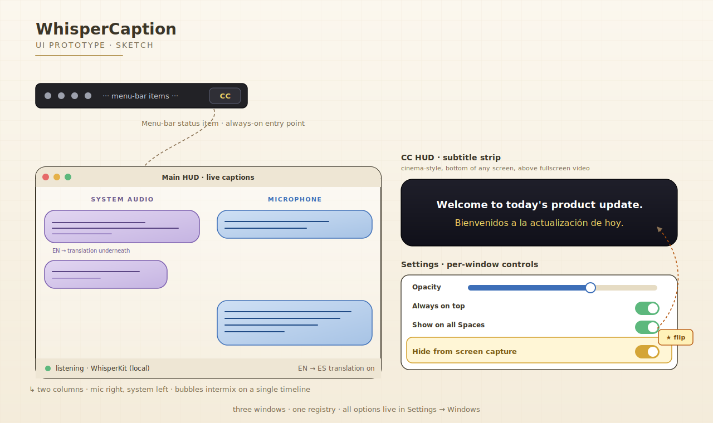
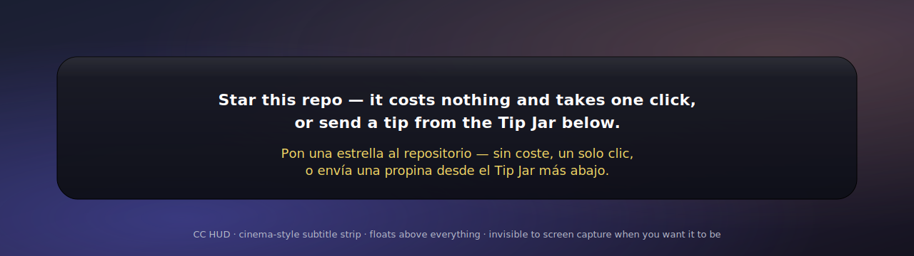

<div align="center">

# 🎙️ WhisperCaption

**Live, dual-stream captions for macOS.**
**Your microphone _and_ whatever your Mac is playing — transcribed side by side, in real time, on your machine.**

<br />

<!-- Identity -->
[](LICENSE)
[](#requirements)
[](https://swift.org)
[](https://developer.apple.com/documentation/swiftui)
[](https://github.com/albond/WhisperCaption/actions/workflows/ci.yml)
[](https://github.com/albond/WhisperCaption/releases)
[](#privacy-the-whole-point)
[](#privacy-the-whole-point)

<!-- Community -->
[](https://github.com/albond/WhisperCaption/stargazers)
[](https://github.com/albond/WhisperCaption/network/members)
[](https://github.com/albond/WhisperCaption/watchers)
[](https://github.com/albond/WhisperCaption/graphs/contributors)

<!-- Activity -->
[](https://github.com/albond/WhisperCaption/commits)
[](https://github.com/albond/WhisperCaption/pulse)
[](https://github.com/albond/WhisperCaption/issues)
[](https://github.com/albond/WhisperCaption/pulls)

<!-- Repo -->
[](#)
[](#)
[](#)
[](https://github.com/albond/WhisperCaption/releases)

<!-- Sponsor -->
[](#-support-the-project)

<br />

### ⭐ If WhisperCaption makes one of your calls easier, [star this repo](https://github.com/albond/WhisperCaption/stargazers) — it's free, it takes one click, and it's the single biggest "thank you" you can send a solo open-source maintainer. Prefer a tip? [Jump to the Tip Jar.](#-support-the-project)

<br />

[**Why?**](#why-whispercaption) · [**Features**](#-features) · [**Privacy**](#privacy-the-whole-point) · [**Engines**](#-three-engines-your-choice) · [**Languages**](#-language-support-by-engine) · [**Install**](#-get-started) · [**FAQ**](#-faq) · [**Star ⭐**](https://github.com/albond/WhisperCaption/stargazers) · [**Donate**](#-support-the-project)

<br />



<sub><em>Demo dialogue · sample data, not a real conversation.</em></sub>

</div>

---

## Why WhisperCaption

Modern macOS is finally good at hearing **you** — system-wide dictation is a single shortcut away. What it still can't do well is hear the **other** side of your call, your YouTube tutorial, your foreign-language podcast, your colleague's heavily-accented standup — and put it next to your own voice as a live, two-column transcript that you can read, search, save, and translate.

WhisperCaption is the small native app that does exactly that. It captures **two independent audio streams at the same time** — your microphone and whatever macOS is playing through its speakers — runs each through a transcription engine of your choice, and renders the result as a live chat: **you on one side, them on the other**.

And because the only thing more sensitive than the words you say is the words you read on screen, it ships with a switch that makes the captions **completely invisible to screen recording and screen sharing**. You see them. Zoom doesn't. Meet doesn't. QuickTime doesn't. Your screenshots don't.

It's free. It's MIT. The full source is right here in front of you. Build it, audit it, fork it, ship it.

---

## 🗺 How the windows fit together

Three independent windows, one menu-bar status item, one settings registry. Each window has its own opacity, always-on-top, and on-all-Spaces controls — and every window honours the global **Hide from screen capture** switch.

<div align="center">



</div>

---

## ✨ Features

<table>
<tr>
<td width="50%" valign="top">

### 🎤 Dual-stream capture
Microphone **and** system audio simultaneously, on independent pipelines. No virtual loopback devices, no BlackHole, no aggregate devices to set up. Each side is transcribed in its own column so you always know who said what.

</td>
<td width="50%" valign="top">

### 🧠 Three engines, your choice
**WhisperKit** for fully on-device, fully free, fully offline transcription. **Deepgram Nova-3** and **ElevenLabs Scribe v2** for state-of-the-art cloud quality when you'd rather have accuracy than airplane-mode. Bring your own API key.

</td>
</tr>
<tr>
<td valign="top">

### 🕶 Hide from screen capture
One switch flips every WhisperCaption window's `NSWindow.sharingType` to `.none`. The captions stay visible to you on the glass — and disappear from Zoom, Meet, Teams, OBS, screen recordings, and screenshots taken by other apps. **Read your translation live during a call. Nobody else sees a thing.**

</td>
<td valign="top">

### 🌍 Free on-device translation
Powered by Apple's built-in Translation framework — no API key, no network, no quota. Auto-translates the system-side stream into your target language in real time, right inside the caption strip. Source language auto-detected.

</td>
</tr>
<tr>
<td valign="top">

### 📺 Floats above _everything_
The caption strip rides above fullscreen video, above presentations, above other apps' "always on top" windows. Available on **every connected display** with per-display sizing — pick a screen, pin it there, switch presentations freely.

</td>
<td valign="top">

### 💾 Local-first chat history
Every session is saved as a searchable JSON-backed transcript on your disk. Browse, filter, export. Nothing is uploaded. Nothing is synced. Delete a session and it's gone — there is no remote copy because there is no remote anything.

</td>
</tr>
<tr>
<td valign="top">

### 🎚 Per-window fine control
Independent **opacity**, **always-on-top**, and **show-on-all-Spaces** settings for the main caption view _and_ for the bottom-of-screen CC strip. Tune each window to fit your workflow without forcing one set of rules on the other.

</td>
<td valign="top">

### ⌨️ Hotkeys, App Intents, Shortcuts
Global keyboard shortcuts for toggling each HUD and cycling opacity. App Intents for Stream Deck, Raycast, Apple Shortcuts, and the menu-bar quick actions: _Toggle Main HUD_, _Toggle CC HUD_, _Set Opacity_, _Take Screenshot_.

</td>
</tr>
<tr>
<td valign="top">

### 📸 Snapshot the moment
A single keystroke (or menu item, or Shortcut) captures the active window of the focused app and attaches it to your transcript — handy when somebody shares a diagram on a call and the audio alone doesn't capture what they meant.

</td>
<td valign="top">

### 🧰 Built natively
SwiftUI for the UI, AppKit + CoreAudio Process Tap for the heavy lifting. No Electron, no JavaScript runtime, no bundled Chromium. Cold launch is instant; idle CPU is zero; battery impact during a call is barely measurable.

</td>
</tr>
</table>

---

## Privacy: the whole point

WhisperCaption was built on the assumption that **the thing on your screen during a 1:1 with your manager is no one else's business**. That belief shows up in three concrete places:

- **The source is the binary.** There are no pre-built releases anywhere. To get WhisperCaption, you clone this repo and build it locally in Xcode. That means the binary running on your Mac was compiled from the code _you just read_, signed with _your own_ Apple ID — not somebody else's. There is literally no opportunity for a tampered build to reach you.
- **Nothing leaves your Mac unless you choose to send it.** With WhisperKit selected, **zero bytes of audio leave the device**, ever — transcription happens entirely on the Neural Engine and CPU. If you opt into the cloud engines, your audio goes _only_ to the API endpoint of the provider whose key you typed in, over a direct WebSocket. No analytics SDK, no crash reporter, no telemetry pipe to any third party. Grep the source for `URL(` and see for yourself.
- **No accounts, no signups, no maintainer-side knowledge of who you are.** There is no login, no email field, no opt-in newsletter. The maintainer (`albond`) literally cannot identify users of WhisperCaption — there is no backend that knows about them.

And on top of all that, the **Hide from screen capture** switch makes the windows invisible to other apps' capture APIs — so even on calls where you don't trust the meeting platform, the foreign-language subtitle ticker isn't going to embarrass you.

> Trust shouldn't be a feature. With WhisperCaption, you don't have to take anyone's word for it — the receipts are in the repo.

---

## 🌐 Three engines, your choice

| Engine | Runs | Cost | Best for |
|-|-|-|-|
| **WhisperKit** | On-device, on the Neural Engine | **Free** | Airplane mode, paranoid mode, sensitive calls, anywhere you want absolute certainty no audio leaves your Mac |
| **Deepgram Nova-3** | Cloud (your API key) | Pay-as-you-go on your Deepgram account | Multi-speaker calls in English / Spanish / French / German / Hindi / Russian / Portuguese / Japanese / Italian / Dutch where you want the strongest punctuation + diarisation cues |
| **ElevenLabs Scribe v2** | Cloud (your API key) | Pay-as-you-go on your ElevenLabs account | 90+ languages with auto-detect, when you don't know in advance what language a guest will speak |

Switch between engines in **Settings → Speech Recognition** at any time. Each engine's UI section only shows the fields it needs — model folder picker for WhisperKit, key field for the cloud engines.

> **WhisperKit policy:** WhisperCaption does **not** auto-download model weights. You point Settings at a Whisper model folder you've downloaded yourself (e.g. via `huggingface-cli` or `git lfs`), and WhisperCaption only reads from it. This is a deliberate trust choice: the app never silently pulls multi-gigabyte binary blobs over the network.

---

## 🌍 Language support by engine

The **Languages** picker in Settings → Speech Recognition is **driven by the active engine's capabilities** — it only shows you the languages the chosen engine can actually transcribe. Switching engines re-populates the list. Here's the lay of the land:

### 🪶 WhisperKit — 99 languages

Anything the Whisper model itself supports. Pick one for monolingual mode, or several for in-engine auto-detection. Full set (ISO 639-1 / Whisper codes):

```
af · am · ar · as · az · ba · be · bg · bn · bo · br · bs · ca · cs · cy · da
de · el · en · es · et · eu · fa · fi · fo · fr · gl · gu · ha · he · hi · hr
ht · hu · hy · id · is · it · ja · jw · ka · kk · km · kn · ko · la · lb · ln
lo · lt · lv · mg · mi · mk · ml · mn · mr · ms · mt · my · ne · nl · nn · no
oc · pa · pl · ps · pt · ro · ru · sa · sd · si · sk · sl · sn · so · sq · sr
su · sv · sw · ta · te · tg · th · tk · tl · tr · tt · uk · ur · uz · vi · yi
yo · zh
```

### ☁️ Deepgram Nova-3 — 34 languages, two modes

**Multilingual real-time** (the engine can code-switch _between_ these in a single stream, useful when the other party slips between languages mid-sentence):

```
en · es · fr · de · hi · ru · pt · ja · it · nl
```

**Monolingual real-time** (the engine handles each of these on its own, but cannot mix them with others on the same stream):

```
bg · ca · cs · da · el · et · fi · hu · id · ko · lt · lv · ms · no · pl · ro
sk · sv · ta · th · tr · uk · vi · zh
```

> Heads-up: **Ukrainian (`uk`)** is monolingual-only on Nova-3. If you select `uk` together with another language, WhisperCaption falls back to monolingual `uk` and surfaces an inline warning in Settings — that's the closest match to what the API can deliver.

### ☁️ ElevenLabs Scribe v2 — 90+ languages, auto-detect

The full Whisper-class set, same codes as the WhisperKit list above. Pick one language to lock the engine to it, **or leave the picker empty for auto-detection across the entire set** — Scribe v2 figures out what's being spoken on its own and tags every chunk with the detected language. This is the best engine to keep selected when you don't know in advance what language a guest is going to speak.

### Apple Translation (free, on-device) — separate from STT

Translation is independent from the transcription engine you pick: any of the three STT engines feeds into Apple's built-in Translation framework for live, on-device translation of the system-audio side. **The available target languages are whatever your macOS version's Translation framework supports** (typically 20+ pairs as of macOS 15) — WhisperCaption queries the framework directly and shows you the live list, rather than hardcoding one.

---

## 🚀 Get started

### Requirements

- **macOS 15.0** Sequoia or later
- About **2 GB** of free disk for a Whisper Small model if you go fully offline (more for Medium / Large)
- For the source path only: **Xcode 16** or later

### Option A — Install the pre-built `.dmg` (one minute)

1. Download `WhisperCaption-X.Y.Z.dmg` from the [latest release](https://github.com/albond/WhisperCaption/releases/latest).
2. Open the `.dmg`, drag **WhisperCaption** into **Applications**.
3. **First launch:** right-click `WhisperCaption.app` in Applications and choose **Open** — then click **Open** again in the dialog. macOS asks once because the app is signed by a free Apple Personal Team rather than a paid Developer ID (it's not notarized — the trade-off is no $99/year fee feeding back to Apple, and no notarization metadata exposing anything about you to Apple's logs). After the first launch, double-click works as normal forever.

If you'd rather not bypass Gatekeeper manually, build from source — see Option B.

#### Verify the signature before running

Before granting the app Microphone / Screen Recording permissions, you can confirm the binary was signed by the same brand identity that publishes the source — i.e. the `.dmg` wasn't repackaged downstream:

```sh
codesign -dvvv /Applications/WhisperCaption.app 2>&1 | grep '^Authority'
```

Expected output (first line is what matters):

```
Authority=Apple Development: albond.dev@proton.me (...)
Authority=Apple Worldwide Developer Relations Certification Authority
Authority=Apple Root CA
```

If the first line says **anything other than** `albond.dev@proton.me`, the binary was re-signed somewhere along the way — don't trust it, file an issue.

### Option B — Build it yourself in two minutes

```sh
git clone https://github.com/albond/WhisperCaption.git
cd WhisperCaption
open WhisperCaption/WhisperCaption.xcodeproj
```

In Xcode:
1. Select the **WhisperCaption** scheme.
2. Optional: create `WhisperCaption/Local.xcconfig` from `Local.xcconfig.template` and fill in your Apple Developer Team ID for stable TCC permissions. Skip this and Xcode signs the build ad-hoc — the app still runs, you just re-grant Microphone + Screen Recording on every rebuild.
3. ⌘R. Grant **Microphone** and **Screen Recording** when macOS asks.

The binary your local build produces is signed under **your own** Apple ID, not the maintainer's — Gatekeeper accepts it on your machine without any prompt.

### First run

- Click the menu-bar icon → **Open Main HUD**.
- Open **Settings** → **Speech Recognition**, pick an engine.
- If you chose **WhisperKit**, click **Choose model folder…** and point it at your local Whisper model directory.
- If you chose **Deepgram** or **ElevenLabs**, paste your API key. Keys are stored in your macOS Keychain.
- Hit the start button on the Main HUD and start talking.

For the cinema-style caption strip across the bottom of the screen, open **Settings → CC HUD** and toggle it on. It defaults to displaying the system-audio side of the conversation (i.e. the other party on a call), and respects translation if you have it on.

---

## ⌨️ Hotkeys, App Intents, Shortcuts

Out of the box, WhisperCaption registers global hotkeys you can rebind in **Settings → Hotkeys**:

| Action | Surface |
|-|-|
| Toggle Main HUD | Global hotkey · Menu bar · App Intent · Shortcuts |
| Toggle CC HUD | Global hotkey · Menu bar · App Intent · Shortcuts |
| Cycle window opacity | Global hotkey · App Intent · Shortcuts |
| Take screenshot | Menu bar · App Intent · Shortcuts |

Because everything important is an App Intent, you can wire any of it to a Stream Deck button, a Raycast script, a Keyboard Maestro macro, or a single tap of an Elgato gamepad. The "F-key on my desk" school of hotkeys is fully supported.

---

## ❓ FAQ

**Why does my Mac say "WhisperCaption can't be opened because Apple cannot check it for malicious software"?**
Because the `.dmg` is signed by a free Apple Personal Team rather than a paid `$99/year` Developer ID + Apple notarization. Free Personal Team signing is enough for Gatekeeper to know _who_ signed the binary (you can audit it via `codesign -dvvv`) but it doesn't carry an Apple-issued notarization stamp — so macOS shows the warning on first launch. Right-click → **Open** once and macOS remembers your choice forever. The trade-off is deliberate: skipping the Developer Program means no $99 yearly fee to Apple and no notarization metadata in Apple's logs.

**Can I trust the published `.dmg`?**
The published `.dmg` is signed by the same Apple ID (`albond.dev@proton.me`) that owns the GitHub repo and the brand. Run `codesign -dvvv /Applications/WhisperCaption.app | grep Authority` — the first Authority line must read `Apple Development: albond.dev@proton.me (...)`. If it doesn't, something between this repo and your `.dmg` re-signed the binary, and you shouldn't run it. If you want zero trust in the binary supply chain, [build from source](#option-b--build-it-yourself-in-two-minutes) — every commit goes through [CI](https://github.com/albond/WhisperCaption/actions) and you compile against code you can read in five minutes.

**Is the cloud engine cheaper than WhisperKit?**
WhisperKit is free; cloud engines bill on usage and need an internet connection. For an hour-long meeting once a day, Nova-3 / Scribe v2 cost roughly the price of a coffee per month at the time of writing — but those numbers change. The point of supporting both is so you can switch in either direction without changing apps.

**Does it work with FaceTime / Zoom / Meet / Teams / Discord / Slack Huddles?**
Yes. WhisperCaption captures the **system audio output** — i.e. anything macOS is playing through its speakers or virtual output — not a specific app. Whatever the meeting client is, its audio goes through CoreAudio, and CoreAudio is what WhisperCaption taps.

**Why ask for Screen Recording permission?**
The cleanest API for "tap the system-wide audio mix without changing devices" lives behind the same TCC entitlement as screen capture. WhisperCaption never reads pixels for transcription — only audio frames — but macOS gates them together. If you're curious, the relevant code is in `WhisperCaption/Capture/SystemCapture.swift`.

**Does it support Windows / Linux?**
No, and probably never will. It's intentionally a native macOS app — the dual-stream capture story works because of CoreAudio Process Tap, which is a macOS-only API. Cross-platform versions of "live captions" exist; this isn't one.

**Is my chat history readable by other apps?**
No. It lives in your sandboxed Application Support directory in plain JSON — your other apps can't reach it without explicit Full Disk Access. You can delete a session from inside the app, or wipe the folder by hand. There's no cloud copy because there's no cloud anything.

**I want to contribute / file a bug / suggest a feature.**
[Open an issue](https://github.com/albond/WhisperCaption/issues) or a PR. Smaller bug fixes are easier to merge than sweeping refactors — please open an issue first if you want to change something architectural.

---

## 💝 Support the project

WhisperCaption is free under the MIT licence and will stay that way. If it has saved you a coffee's worth of time, you can buy the maintainer one back — **directly to a wallet, with no third party in the middle**.

Stablecoin tips are appreciated and go to a single Ethereum-mainnet address. From inside the app you can scan a QR code via **Settings → Tip Jar**; here's the bare address for copy-paste:

| Token | Network | Address |
|-|-|-|
| **USDC** _(USD-pegged, Circle)_ | Ethereum mainnet | `0xF734F20bFeB7ddb3f0519ADAfbBa056939c9C261` |
| **USDT** _(USD-pegged, Tether)_ | Ethereum mainnet | `0xF734F20bFeB7ddb3f0519ADAfbBa056939c9C261` |
| **EURC** _(EUR-pegged, Circle)_ | Ethereum mainnet | `0xF734F20bFeB7ddb3f0519ADAfbBa056939c9C261` |

> The address is the same for all three — they're ERC-20 tokens on the same chain. **Double-check** before you send: send only to **Ethereum mainnet**. Tokens sent on the wrong chain are unrecoverable.

The Tip Jar inside the app generates a wallet-deeplink QR code that pre-fills the recipient, the token contract, and (optionally) the amount, so any modern wallet (MetaMask, Trust Wallet, Rainbow, Coinbase Wallet, etc.) can pay with two taps.

If GitHub Sponsors is more your speed, star the repo — that's also a tip, in the currency of "the algorithm noticed".

<br />

<div align="center">

<a href="https://github.com/albond/WhisperCaption/stargazers"></a>

<sub><em>↑ A live preview of the CC HUD subtitle strip, captioning its own pitch in real time. Click to star.</em></sub>

</div>

---

## 📬 Contact

- **Bugs / features:** [GitHub Issues](https://github.com/albond/WhisperCaption/issues)
- **Anything else:** `albond.dev@proton.me`

---

## 📄 License

Released under the [MIT License](LICENSE). Built on top of **WhisperKit** and **swift-transformers**, both also open source. Apple Translation, Speech, AppKit, and SwiftUI are Apple frameworks.

<br />

<div align="center">

**Made for everyone who reads more languages than they speak.**

⭐ Star the repo if WhisperCaption made one of your calls easier.

</div>
